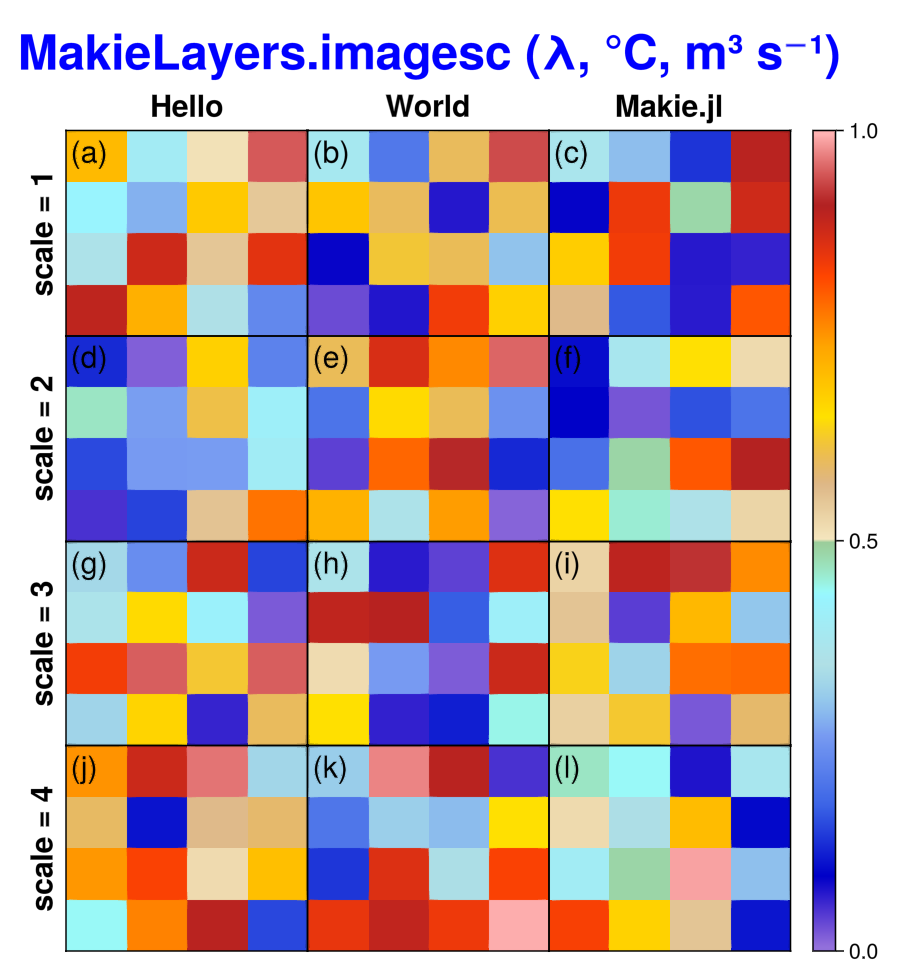

# MakieLayers.jl for personal usage

[](https://jl-pkgs.github.io/MakieLayers.jl/stable)
[](https://jl-pkgs.github.io/MakieLayers.jl/dev)
[](https://github.com/jl-pkgs/MakieLayers.jl/actions/workflows/CI.yml)
[](https://codecov.io/gh/jl-pkgs/MakieLayers.jl)

> Dongdong Kong

## Installation

```julia
using Pkg
Pkg.add(url="https://github.com/jl-pkgs/MakieLayers.jl")
# ] add https://github.com/jl-pkgs/MakieLayers.jl
```


## Functions

- `imagesc`: inspired by the MATLAB version
- `ncl_colors`: 270 NCL colors

## Examples

```julia
using GLMakie
using MakieLayers
using Ipaper

set_seed(2)
label_tag(xs) = map(x -> "($x)", xs)

x = 2:11
y = 2:11
fig = Figure(; size=(600, 650))

axs, plts = imagesc!(fig, rand(4, 4, 12), layout=(4, 3), byrow=true, 
  fun_axis=rm_ticks!,
  colorrange=(0, 1), gap=(0, 0, 15))

## add flags
flags = letters.(1:16) |> label_tag
add_texts!(axs, flags, fontsize=20, 0.02, 0.98, align=(0, 1))

labels = ["Hello", "World", "Makie.jl"]
add_row_labels!(fig, labels, fontsize=20, gap=5)

labels = ["scale = 1", "scale = 2", "scale = 3", "scale = 4"]
add_col_labels!(fig, labels, fontsize=20, gap=5)

# Title
Label(fig[-1, :], "MakieLayers.imagesc (λ, °C, m³ s⁻¹)", font=:bold, fontsize=32, color=:blue)
rowgap!(fig.layout, 1, 5)
fig
```




**图1**. ERA5 2000-2024水汽通量与水汽通量散度（kg m-2 s-1）。
